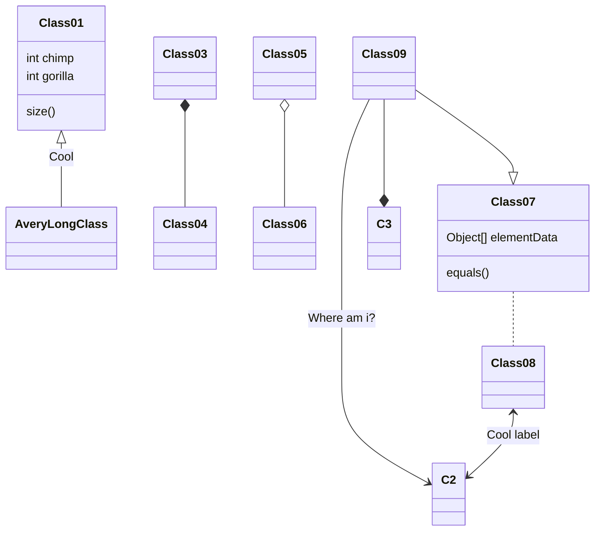

# Introduction
This project defines the data model of ReportHub and extracts current models from MongoDB


## Quick install

1) Install the latest version of python and virtualenv.
```
virtualenv installation:
https://virtualenv.pypa.io/en/latest/installation.html
```
2) Clone this repository
```
git clone git@github.com:iMMAP/reporthub-db.git
```
4) Create virtualenv environment
```
cd reporthub-db
virtualenv --python=<YOUR_LOCAL_PYTHON_PATH> .venv
```
3) Install packages
```
pip install -r requirements.txt
```
4) Activate your environment
```
source .venv/bin/activate
```


## Data Model

